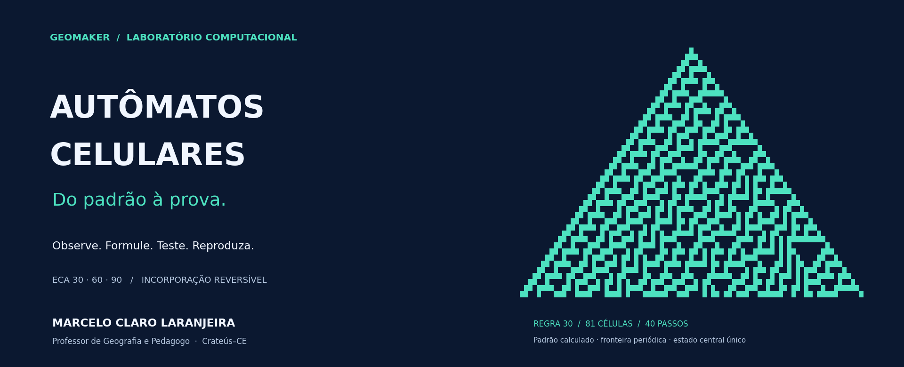

# Autômatos celulares · do padrão à prova

Um laboratório para **aprender, testar e reproduzir** a relação entre ECA clássico e sua incorporação reversível em circuitos quânticos.

[Protocolo científico](docs/PROTOCOL.md) · [Especificação SDD](docs/SDD.md) · [Correção Colab v3.2.2](docs/COLAB_BOOTSTRAP_V322.md) · [Validação v3.2](docs/V32_VALIDATION.md) · [Plano do artigo](docs/ARTICLE_PLAN.md)

**CPU · sem API paga obrigatória · três SDKs · dados auditáveis**

> O experimento não demonstra vantagem quântica. Compara simuladores clássicos de circuitos e uma referência matemática no domínio especificado.

## Quem conduz o projeto

### MARCELO CLARO LARANJEIRA

**Professor de Geografia e Pedagogo** · Crateús, Ceará, Brasil 
Autoria e apresentação do projeto: [@MarceloClaro](https://github.com/MarceloClaro).

[GeoMaker](https://bit.ly/geomaker) · [ORCID 0000-0001-8996-2887](https://orcid.org/0000-0001-8996-2887) · [Instagram @marceloclaro.geomaker](https://www.instagram.com/marceloclaro.geomaker/)

A proposta didática conecta leitura de padrões, raciocínio computacional e investigação: **observar → formular → testar → interpretar → reproduzir**. A capa usa uma evolução calculada da regra 30, não uma ilustração de resultados inventados.

## Abra e execute

1. Abra o **Colab** pelo botão acima.
2. Selecione **CPU / nenhum acelerador**.
3. Deixe o perfil **smoke** e clique em **Executar tudo**.
4. Leia o painel final e baixe o ZIP no painel **Arquivos**, pelo caminho mostrado. O download automático é opcional.

A primeira instalação cria um ambiente virtual separado. **Não troca NumPy ou TensorFlow do kernel Colab.** As etapas científicas rodam em subprocessos CPU com threads limitadas. Se o kernel estiver em Python 3.13, a v3.2.2 obtém Python 3.12 dentro de `/content`. O instalador `uv==0.12.9` vem de um wheel oficial com SHA-256 fixado e **não depende de pip, venv ou ensurepip do kernel**; o próprio uv cria o ambiente científico. O bootstrap automático destina-se ao Linux x86_64 do Colab.

**Recebeu erro em `python -m venv` na v3.2.1?** Reabra o notebook atualizado, confirme **v3.2.2** no título e use **Executar tudo**. O novo checkout e o carregamento explícito do módulo evitam reutilizar a correção antiga em memória. Não é necessário apagar seus resultados ou excluir uma sessão que continua conectada.

Cada **Executar tudo** cria uma pasta exclusiva; execuções anteriores não são sobrescritas. A célula de coleta reutiliza um resultado completo da mesma execução, depois de verificar sua integridade. Reproduzir as mesmas sementes não aumenta a amostra.

### Escolha sua trilha

| Para aprender | Para pesquisar |
|---|---|
| Comece por smoke | Leia SDD e protocolo antes de escolher paper |
| Leia a tabela de verdade e os mapas espaço–tempo | Confira domínio, estimandos, sementes e gates |
| Compare entrada e saída nas três implementações | Inspecione CSVs brutos, manifesto e checksums |
| Interprete superposição, fase e entropia | Separe canal lógico, ruído nativo e hardware |
| Resolva sete exercícios com gabarito comentado | Não trate reprodução como nova confirmação |

## Modelo, sem atalhos conceituais

Uma regra ECA pode perder informação: entradas diferentes podem produzir a mesma saída. Por isso não usamos, em geral, a transformação simples que apaga a entrada. Preservamos o registro de entrada:

$$U_F|x\rangle|y\rangle=|x\rangle|y\oplus F(x)\rangle.$$

Aplicar o mesmo XOR duas vezes desfaz a operação. O modelo é uma **incorporação reversível de uma etapa ECA finita**, não uma QCA física infinita completa.

| Camada | O que realmente é executado |
|---|---|
| ECA clássico | Regras 30, 60 e 90; atualização síncrona; fronteira periódica |
| Qiskit, PennyLane, Cirq | Três sínteses por SDK; referência analítica comum e convenção canônica de bits |
| Coerência | Fidelidade, erro após alinhamento de fase global e entropia entrada–saída |
| TensorFlow Quantum | Integração TensorFlow–Cirq; expectativas comparadas com Cirq real **e** referência analítica |
| Ruído | Bit-flip de saída amostrado em NumPy; mesma realização associada aos três SDKs |
| Estatística | Unidades pareadas, IC95% bootstrap e bandas Bonferroni–Hoeffding |
| Tempo | Construção + simulação após warm-up; ordem randomizada; mediana e IQR |
| Evidência | Oito CSVs, duas figuras científicas, manifesto, relatório, ZIP e SHA-256 |

**TFQ não é uma quarta implementação independente.** O ruído não é executado em canais nativos separados de Aer, PennyLane e Cirq. As etiquetas de SDK compartilham a realização de cada unidade; somar as três linhas como réplicas seria pseudorreplicação. As bandas de decisão preservam o desenho congelado; as figuras mostram um único representante do canal comum por regra.

## Como a execução se organiza

~~~mermaid
flowchart TD
    A["Kernel Colab: interface leve"] --> B["Ambiente virtual: CPU"]
    B --> C["TDD e gates dos três SDKs"]
    C --> D["TFQ em subprocesso"]
    D --> E["Ruído, estatística e benchmark"]
    E --> F["Painel, CSVs, figuras e ZIP"]
    F --> G["Verificação SHA-256"]
~~~

O painel distingue **gate técnico aprovado** de **H3/H4 avaliadas**. No perfil smoke, H3/H4 aparecem como **não avaliadas**, mesmo quando todos os testes passam.

## Perfis congelados

| Parâmetro | smoke | paper |
|---|---:|---:|
| Células ECA / qubits totais | 3 / 6 | 5 / 10 |
| Estados determinísticos | 8 | 32 |
| Estados de ruído | 2 | 8 |
| Níveis de bit-flip | 3 | 7 |
| Sementes-base | 2 | 5 |
| Shots por unidade | 512 | 4.096 |
| Reamostragens bootstrap | 1.000 | 10.000 |
| Unidades distintas de ruído | 36 | 840 |
| Linhas pareadas no CSV de ruído | 108 | 2.520 |

Os mapas didáticos usam configurações ilustrativas separadas e **não entram na coleta confirmatória**. As regras, probabilidades, estados, sementes e critérios de decisão continuam os da Emenda 1. A revalidação v3.2 é reprodução de engenharia, não confirmação independente.

## Ambiente verificado

| Componente | Versão fixada |
|---|---|
| Python de execução | 3.11 ou 3.12; validação local em 3.12 |
| NumPy | 2.0.2 |
| Qiskit / Aer | 2.5.2 / 0.17.2 |
| PennyLane | 0.45.1 |
| Cirq Core | 1.5.0 |
| TensorFlow / TF-Keras | 2.18.1 / 2.18.0 |
| TensorFlow Quantum | 0.7.6 |

A matriz prioriza compatibilidade, não versões mais recentes. As dependências declaradas de [TFQ 0.7.6](https://pypi.org/project/tensorflow-quantum/0.7.6/) exigem essa linha Cirq/TF-Keras; a lista completa está em [requirements-eca-colab.txt](requirements-eca-colab.txt). TF_USE_LEGACY_KERAS=1 é definido antes do import no processo científico.

## Validação manual, sem GitHub Actions

**Não há workflow ativo em .github/workflows.** O exemplo está arquivado em [docs/workflows/eca-confirmatory.yml.example](docs/workflows/eca-confirmatory.yml.example); esse local e essa extensão não acionam o GitHub Actions. O badge de CI foi removido.

Isso evita novas execuções hospedadas deste projeto; **não cancela débitos, assinaturas ou cobranças anteriores da conta**. Colab possui modalidade gratuita, mas recursos e duração não são garantidos: [FAQ oficial](https://research.google.com/colaboratory/faq.html).

Em Linux/macOS, com Python 3.12 instalado:

~~~bash
python3.12 -m venv .venv-eca
source .venv-eca/bin/activate
python -m pip install -r requirements-eca-colab.txt
python scripts/validate_eca_all.py --profile smoke --notebook
~~~

O comando executa TDD, o experimento, o verificador do ZIP e, com a opção notebook, duas passagens num **mesmo kernel Jupyter real**. Os logs e resultados ficam em pasta própria. Para a reprodução técnica do perfil maior, use profile paper; isso não altera sementes nem constitui nova coleta independente.

Se um ambiente restrito proibir iniciar Jupyter, existe a opção explícita **--notebook-executor namespace** para testar o Python célula a célula. Esse modo não valida transporte Jupyter nem o frontend Colab e registra a limitação no relatório. Não há fallback silencioso.

## Evidências e arquivos

Validação v3.2: **463 testes ECA e 478 testes totais aprovados**, perfis smoke/paper reproduzidos e 11 células de código executadas duas vezes em namespace Python. **Execução real no Colab/Jupyter ainda não comprovada nesta revisão**; a tentativa Jupyter foi bloqueada por permissões do ambiente. Consulte o relatório para o escopo exato.

O ZIP contém **10 artefatos científicos + manifesto + relatório + checksums**. No esquema 3.2, os hashes cobrem os 10 artefatos e os dois JSONs de metadados. O hash do próprio ZIP fica em um recibo externo, evitando circularidade. A verificação não extrai nomes fornecidos pelo ZIP e rejeita membros inesperados/duplicados.

SHA-256 detecta alterações acidentais quando comparado a uma referência confiável; **não autentica autoria nem comprova correção científica**.

- [Validação atual e limitações](docs/V32_VALIDATION.md)
- [Histórico da validação v3.1](docs/ECA_VALIDATION.md)
- [SDD e rastreabilidade](docs/SDD.md)
- [Protocolo e emendas](docs/PROTOCOL.md)
- [Plano de artigo e lacuna ainda a investigar](docs/ARTICLE_PLAN.md)

Rigor e transparência melhoram a pesquisa, mas não garantem novidade, aceite ou classificação Qualis A1.

## Se algo interromper

| Sintoma | Conduta |
|---|---|
| HTTP 502 em kernelspecs antes de qualquer saída Python | Reconecte uma sessão CPU; é indisponibilidade de kernel/proxy, não resultado experimental |
| Kernel Colab em Python 3.13 | A v3.2.2 baixa Python 3.12 gerenciado em `/content`; confirme a versão no cabeçalho |
| `python -m venv` retornou código 1 na v3.2.1 | Reabra a v3.2.2; o novo bootstrap não usa pip/venv/ensurepip do kernel |
| Instalação interrompida | Reexecute a etapa de ambiente; não avance com matriz divergente |
| Falha em teste/gate | Preserve a saída do erro; não reduza tolerâncias para obter aprovação |
| Pasta com resultados parciais | Use Executar tudo para criar outra pasta; não apague nem substitua dados silenciosamente |

Não compartilhe URLs do runtime que contenham tokens. Desconectar a sessão limita a exposição de credenciais temporárias.

Código sob [GPL-3.0](LICENSE). Para atribuição, use [CITATION.cff](CITATION.cff) e registre o commit do manifesto.
