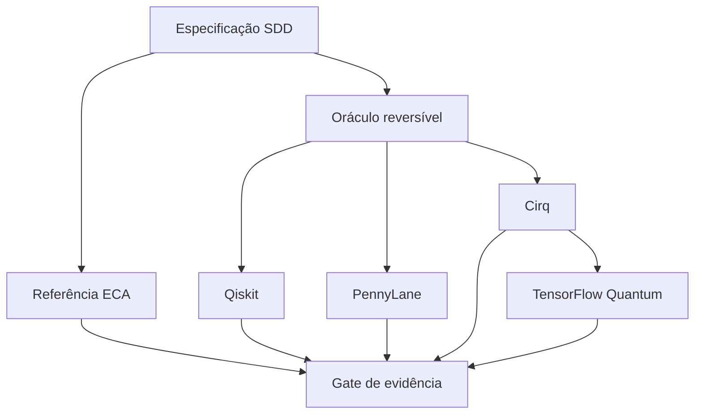

# Autômatos celulares clássicos e quânticos

Documentação científico-didática de um experimento multiframework para comparar autômatos celulares elementares (ECA) com uma **incorporação quântica reversível** das regras 30, 60 e 90 em Qiskit, PennyLane, Cirq e TensorFlow Quantum (TFQ).

> O objetivo não é demonstrar vantagem, supremacia ou aceleração quântica. Em simuladores clássicos, a comparação deve verificar correção semântica, reprodutibilidade, emaranhamento, robustez controlada ao ruído e custo das pilhas de software.

## Estado deste envio

Este envio adiciona a documentação da versão 2.0:

- [especificação SDD e matriz de rastreabilidade](docs/SDD.md);
- [protocolo científico confirmatório](docs/PROTOCOL.md);
- [classificador Iris híbrido estável para Colab](Classificador_Qu%C3%A2ntico_H%C3%ADbrido_de_Alta_Performance_para_Classifica%C3%A7%C3%A3o_de_Dados_Iris_%28Otimizado%29.ipynb);
- [gerador determinístico do notebook Iris](scripts/build_iris_colab.py);
- este README com escopo, compatibilidade e limites de interpretação.

O notebook Iris foi reconstruído após a versão cumulativa exceder os recursos do Colab. Os demais notebooks existentes na raiz são preservados como material histórico. Eles não devem ser tratados como implementação confirmatória da especificação 2.0 sem que os respectivos gates TDD e de evidência tenham sido executados.

## Classificador Iris: correção para o Colab

A versão anterior repetia todo o programa em células cumulativas e criava um novo modelo Keras dentro de cada avaliação COBYLA. Isso mantinha centenas de grafos e camadas na memória até o runtime ser encerrado. A versão atual:

- instala somente dependências ausentes e não substitui o TensorFlow do Colab;
- reutiliza um único simulador Cirq e não cria modelos Keras dentro de loops;
- calcula corretamente quatro expectativas de Pauli-Z;
- separa treino, validação e teste em `60/20/20`, sem escolher arquitetura no teste;
- compara o pipeline híbrido com uma regressão logística clássica pré-especificada;
- oferece os perfis `smoke` e `full`, testes TDD e artefatos com hashes SHA-256.

Antes da primeira execução corrigida, use **Ambiente de execução → Desconectar e excluir ambiente de execução**. Em seguida, abra o link acima, mantenha `PROFILE = "smoke"` e execute as células em ordem. Só então selecione `full` no formulário da célula de configuração.

## Correção conceitual central

Regras como a 30 são irreversíveis: estados de entrada diferentes podem produzir a mesma saída. Portanto, a transformação direta `|x〉 → |F(x)〉` não pode, em geral, ser unitária. O experimento especifica a incorporação reversível

\[
U_F|x\rangle|y\rangle=|x\rangle|y\oplus F(x)\rangle.
\]

Com `y=0`, o segundo registrador contém a atualização clássica, enquanto o primeiro preserva a informação necessária à reversibilidade. Esse circuito representa uma atualização ECA incorporada em uma unitária; não é, sem qualificações adicionais, uma QCA física autônoma completa.

## Arquitetura proposta

TFQ recebe circuitos Cirq. Sua concordância com Cirq valida serialização, execução e integração híbrida, mas não constitui uma quarta replicação algorítmica independente.

## Desenho experimental

| Eixo | Especificação |
|---|---|
| Regras | 30, 60 e 90 |
| Fronteira | Periódica e idêntica em todas as rotas |
| Correção | Todos os `2ⁿ` estados de base do tamanho estudado |
| Paridade | Probabilidades e fidelidade Qiskit × PennyLane × Cirq |
| Regime coerente | Entrada `|+〉ⁿ|0〉ⁿ` e entropia entrada–saída |
| Ruído | Canal bit-flip independente somente no registro de saída |
| Desfechos | BER e probabilidade do bitstring completo correto |
| Incerteza | Réplicas por estado e semente; IC95% bootstrap |
| Desempenho | Warm-up separado; mediana e IQR; apenas simuladores |

O gate de evidência exige primeiro equivalência clássica, paridade entre SDKs e integração TFQ–Cirq. Resultados de ruído, emaranhamento ou tempo não devem sustentar conclusões confirmatórias se esses gates falharem.

## Perfis pré-especificados

| Parâmetro | `smoke` | `paper` |
|---|---:|---:|
| Células | 3 | 5 |
| Estados na validação determinística | 8 | 32 |
| Estados pré-fixados no ensaio de ruído | 2 | 8 |
| Shots | 512 | 4.096 |
| Sementes-base | 2 | 5 |
| Níveis de bit-flip | 3 | 7 |
| Reamostragens bootstrap | 1.000 | 10.000 |

O perfil `smoke` serve para diagnóstico. O perfil `paper` é a configuração confirmatória e deve ser escolhido antes de observar os resultados.

## Matriz de compatibilidade

| Componente | Versão unificada | Motivo |
|---|---:|---|
| Python | 3.12 | Runtime-alvo do Google Colab |
| Qiskit | 2.5.2 | SDK de circuitos |
| Qiskit Aer | 0.17.2 | Simulação e canal de ruído |
| PennyLane | 0.45.1 | Implementação independente |
| Cirq Core | 1.5.0 | Versão fixada por TFQ 0.7.6 |
| TensorFlow | 2.18.1 | Combinação compatível testada |
| TF-Keras | 2.18.0 | TFQ exige a linha legada `<2.19` |
| TensorFlow Quantum | 0.7.6 | Integração TensorFlow–Cirq |

Não se deve atualizar Cirq isoladamente no mesmo runtime: TFQ 0.7.6 declara `cirq-core==1.5.0`. Também é necessário definir `TF_USE_LEGACY_KERAS=1` antes do primeiro import de TensorFlow ou TFQ.

## Reprodutibilidade exigida

- parâmetros e hipóteses definidos antes da coleta;
- sementes-base explícitas e fluxo de simulador derivado por unidade experimental;
- versões importadas, commit, branch e estado do worktree registrados;
- CSVs brutos preservados antes de qualquer agregação;
- figuras em 300 dpi e hashes SHA-256;
- nenhuma credencial ou token IBM em notebook compartilhado;
- execução dos testes antes da interpretação dos resultados.

## Limites de interpretação

- `U_F` é uma incorporação reversível de uma atualização ECA, não uma QCA infinita completa.
- TFQ reutiliza Cirq e não é uma replicação independente.
- Redes pequenas e simulação ideal não generalizam automaticamente para QPUs.
- Shots da mesma execução não substituem réplicas experimentais.
- Tempos dos simuladores não demonstram vantagem quântica.

## Referências essenciais

- WOLFRAM, S. Statistical mechanics of cellular automata. *Reviews of Modern Physics*, v. 55, p. 601–644, 1983. DOI: [10.1103/RevModPhys.55.601](https://doi.org/10.1103/RevModPhys.55.601).
- SCHUMACHER, B.; WERNER, R. F. Reversible quantum cellular automata. 2004. DOI: [10.48550/arXiv.quant-ph/0405174](https://doi.org/10.48550/arXiv.quant-ph/0405174).
- PÉREZ-DELGADO, C. A.; CHEUNG, D. Local unitary quantum cellular automata. *Physical Review A*, v. 76, 032320, 2007. DOI: [10.1103/PhysRevA.76.032320](https://doi.org/10.1103/PhysRevA.76.032320).
- JAVADI-ABHARI, A. et al. Quantum computing with Qiskit. 2024. DOI: [10.48550/arXiv.2405.08810](https://doi.org/10.48550/arXiv.2405.08810).
- BERGHOLM, V. et al. PennyLane: automatic differentiation of hybrid quantum-classical computations. 2018. DOI: [10.48550/arXiv.1811.04968](https://doi.org/10.48550/arXiv.1811.04968).
- BROUGHTON, M. et al. TensorFlow Quantum: a software framework for quantum machine learning. 2020. DOI: [10.48550/arXiv.2003.02989](https://doi.org/10.48550/arXiv.2003.02989).

## Licença

Apache License 2.0. Consulte [LICENSE](LICENSE).
