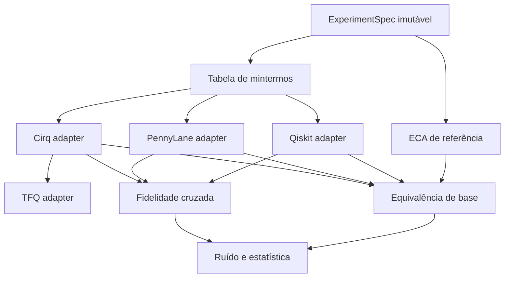

# SDD — benchmark ECA/QCA multiframework

## 1. Finalidade e escopo

Este documento especifica a versão 2.0 do experimento. O sistema deve comparar uma referência clássica de autômatos celulares elementares (ECA) com a incorporação reversível da mesma função booleana em circuitos Qiskit, PennyLane e Cirq, além de validar a execução híbrida via TensorFlow Quantum.

Fora de escopo: alegar vantagem quântica; executar em QPU sem protocolo próprio; tratar uma regra clássica irreversível como unitária no mesmo registrador; confundir TFQ com um SDK de circuito independente de Cirq.

## 2. Modelo matemático

Para uma regra de Wolfram `r ∈ {0,…,255}`, seja

\[
f_r(l,c,d)=\left(r \gg (4l+2c+d)\right)\mathbin{\&}1.
\]

Com fronteira periódica e `n ≥ 3`, a atualização síncrona é

\[
F_r(x)_i=f_r(x_{i-1\bmod n},x_i,x_{i+1\bmod n}).
\]

Como `F_r` pode não ser injetiva, o circuito não sobrescreve `x`. Ele implementa a permutação reversível

\[
U_{F_r}|x\rangle|y\rangle=|x\rangle|y\oplus F_r(x)\rangle.
\]

Cada termo da tabela de verdade cujo resultado é 1 é sintetizado como um X multicontrolado, com inversões temporárias para controles negativos. Os mintermos são mutuamente exclusivos na base computacional e a ação permanece unitária em superposições.

## 3. Arquitetura lógica

## 4. Requisitos funcionais

| ID | Requisito | Critério de aceitação |
|---|---|---|
| FR-001 | Implementar a numeração de Wolfram sem ambiguidade de bits | Tabelas 30, 60 e 90 coincidem com a definição publicada |
| FR-002 | Atualizar todas as células de modo síncrono | Cada linha `t+1` é calculada apenas da linha `t` |
| FR-003 | Usar fronteira periódica no estudo comparativo | Índices laterais calculados módulo `n` |
| FR-004 | Implementar `U_F` nos três SDKs | Toda entrada de base produz exatamente `F_r(x)` no registro de saída |
| FR-005 | Normalizar a ordem de qubits | Fidelidade cruzada ≥ `1 − 2×10⁻⁷` em base e superposição |
| FR-006 | Medir erro sob ruído controlado | BER e sucesso exato por backend, regra, estado, semente e `p` |
| FR-007 | Quantificar emaranhamento | Entropia de von Neumann da partição entrada–saída em bits |
| FR-008 | Integrar TFQ de forma semanticamente honesta | Expectativas TFQ sem ruído coincidem com Cirq dentro de `2×10⁻⁵` |
| FR-009 | Gerar artefatos tabulares | CSVs UTF-8 e JSON de manifesto com esquema estável |

## 5. Requisitos não funcionais

| ID | Requisito | Critério de aceitação |
|---|---|---|
| NFR-001 | Reprodutibilidade | Parâmetros, sementes, versões, commit e estado do worktree registrados |
| NFR-002 | Falha antecipada | Estados, regras, fronteiras, shots e probabilidades inválidos geram exceção explícita |
| NFR-003 | Execução Colab | Python 3.12, CPU e nenhuma credencial obrigatória |
| NFR-004 | Didática progressiva | Tabela booleana → função clássica → circuito → medição → inferência |
| NFR-005 | Desempenho interpretável | Warm-up fora da medição; mediana e IQR; sem linguagem de vantagem quântica |
| NFR-006 | Rastreabilidade | Cada requisito crítico possui ao menos um teste automatizado |

## 6. Contratos dos dados

### Paridade

Campos mínimos: `profile`, `rule`, `state_id`, `initial`, `expected`, `backend`, `passed`, `max_probability_error`, `runtime_seconds`, `fidelity_to_reference`.

### Ruído

Campos mínimos: `profile`, `rule`, `state_id`, `backend`, `bitflip_probability`, `seed` (semente-base), `simulator_seed` (fluxo derivado), `shots`, `bit_error_rate`, `exact_state_success`, valores teóricos e tempo.

### Manifesto

JSON com `schema_version`, data UTC, Python, plataforma, versões, commit, branch, indicador `dirty` e especificação completa.

## 7. Decisões de compatibilidade

1. TFQ 0.7.6 declara `cirq-core==1.5.0`; o runtime unificado fixa essa versão, embora existam versões mais novas do Cirq.
2. TFQ 0.7.6 declara `tf-keras>=2.18,<2.19`; usa-se TensorFlow 2.18.1 e TF-Keras 2.18.0.
3. `TF_USE_LEGACY_KERAS=1` deve ser definido antes do primeiro import TensorFlow/TFQ.
4. Qiskit usa ordem little-endian em seu vetor linear; o adaptador deve transpor os eixos para `q0,…,qN−1` antes da comparação.

## 8. Gate de evidência

1. Testes clássicos passam.
2. Paridade exaustiva de base passa nos três SDKs.
3. Fidelidade cruzada passa em base e `|+〉`.
4. TFQ sem ruído coincide com Cirq.
5. Somente então são calculados ruído, emaranhamento e tempos.

Se qualquer etapa falhar, os resultados posteriores são exploratórios e não devem sustentar conclusão confirmatória.

## 9. Matriz requisito–teste

| Requisito | Testes de aceitação previstos |
|---|---|
| FR-001–003 | Tabelas de verdade, atualização síncrona, fronteiras e enumeração de estados |
| FR-004 | Paridade exaustiva Qiskit, PennyLane e Cirq |
| FR-005 | Fidelidade cruzada em redes de três e cinco células |
| FR-006 | Canal analítico, amostragem, BER e sucesso exato |
| FR-007 | Estados de Bell e produto com entropia conhecida |
| FR-008 | Expectativas e amostras TFQ comparadas a Cirq e à referência clássica |
| NFR-001–002 | Validação de perfis, sementes derivadas, manifesto e hashes |
| NFR-003–004 | Contrato estrutural e execução integral do notebook `smoke` |

## 10. Ameaças à validade

- **Construto:** `U_F` é incorporação reversível de uma etapa, não uma QCA autônoma infinita completa.
- **Interna:** TFQ reutiliza Cirq e não constitui replicação independente.
- **Externa:** redes pequenas e simulação ideal não generalizam automaticamente para QPUs.
- **Conclusão:** múltiplos shots do mesmo circuito não substituem réplicas por estado e semente.
- **Desempenho:** compilação, importação e representação interna diferem; o microbenchmark mede a pilha de software inteira e é apenas descritivo.

## 11. Definition of Done

- todos os requisitos críticos têm teste correspondente;
- os gates de evidência passam antes da análise;
- versões e sementes reais aparecem no manifesto;
- resultados brutos, agregados e hashes são gerados;
- nenhuma conclusão excede o domínio testado;
- o notebook pode ser reproduzido em um runtime Colab limpo.
