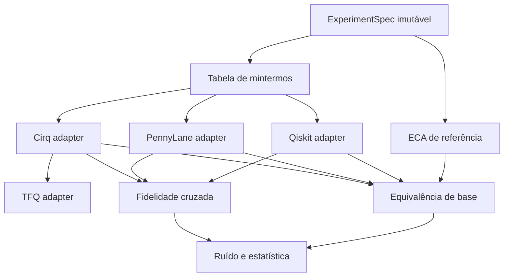

# SDD — benchmark ECA/QCA multiframework

## 1. Finalidade e escopo

Este documento especifica a versão 3.2 do experimento. O sistema compara uma referência ECA com a incorporação reversível em Qiskit, PennyLane e Cirq e valida TFQ–Cirq em processo isolado e reentrante. O kernel da interface Colab não instala nem importa os SDKs científicos.

Fora de escopo: alegar vantagem quântica; executar em QPU sem protocolo próprio; tratar uma regra clássica irreversível como unitária no mesmo registrador; confundir TFQ com um SDK de circuito independente de Cirq.

## 2. Modelo matemático

Para uma regra de Wolfram `r ∈ {0,…,255}`, seja

\[
f_r(l,c,d)=\left(r \gg (4l+2c+d)\right)\mathbin{\&}1.
\]

Com fronteira periódica e `n ≥ 3`, a atualização síncrona é

\[
F_r(x)_i=f_r(x_{i-1\bmod n},x_i,x_{i+1\bmod n}).
\]

Como `F_r` pode não ser injetiva, o circuito não sobrescreve `x`. Ele implementa a permutação reversível

\[
U_{F_r}|x\rangle|y\rangle=|x\rangle|y\oplus F_r(x)\rangle.
\]

Cada termo da tabela de verdade cujo resultado é 1 é sintetizado como um X multicontrolado, com inversões temporárias para controles negativos. Os mintermos são mutuamente exclusivos na base computacional e a ação permanece unitária em superposições.

## 3. Arquitetura lógica

## 4. Requisitos funcionais

| ID | Requisito | Critério de aceitação |
|---|---|---|
| FR-001 | Implementar a numeração de Wolfram sem ambiguidade de bits | Tabelas 30, 60 e 90 coincidem com a definição publicada |
| FR-002 | Atualizar todas as células de modo síncrono | Cada linha `t+1` é calculada apenas da linha `t` |
| FR-003 | Usar fronteira periódica no estudo comparativo | Índices laterais calculados módulo `n` |
| FR-004 | Implementar `U_F` nos três SDKs | Toda entrada de base produz exatamente `F_r(x)` no registro de saída |
| FR-005 | Normalizar a ordem de qubits | Fidelidade cruzada ≥ `1 − 2×10⁻⁷` em base e superposição |
| FR-006 | Medir erro sob canal lógico controlado | BER/sucesso NumPy por unidade; etiquetas de backend pareadas, sem alegar ruído nativo |
| FR-007 | Quantificar emaranhamento | Entropia de von Neumann da partição entrada–saída em bits |
| FR-008 | Integrar TFQ de forma semanticamente honesta | Expectativas TFQ sem ruído coincidem com Cirq dentro de `2×10⁻⁵` |
| FR-009 | Gerar artefatos tabulares | CSVs UTF-8 e JSON de manifesto com esquema estável |
| FR-010 | Preservar cada execução | Pasta exclusiva; coleta recusa sobrescrita; relatório externo igual ao arquivado |
| FR-011 | Interpretar os resultados didaticamente | Mapas calculados, tabelas comparativas, painel dinâmico e sete exercícios comentados |

## 5. Requisitos não funcionais

| ID | Requisito | Critério de aceitação |
|---|---|---|
| NFR-001 | Reprodutibilidade | Parâmetros, sementes, versões, commit e estado do worktree registrados |
| NFR-002 | Falha antecipada | Estados, regras, fronteiras, shots e probabilidades inválidos geram exceção explícita |
| NFR-003 | Ambiente-alvo Colab/local | Kernel 3.11–3.13; computação em Python 3.11/3.12, CPU, venv isolado e nenhuma API paga obrigatória |
| NFR-004 | Didática progressiva | Tabela booleana → função clássica → circuito → medição → inferência |
| NFR-005 | Desempenho interpretável | Warm-up fora da medição; mediana e IQR; sem linguagem de vantagem quântica |
| NFR-006 | Rastreabilidade | Cada requisito crítico possui ao menos um teste automatizado |
| NFR-007 | Reentrância | Repetir Executar tudo não falha por estado residual |
| NFR-008 | Isolamento | Todos os SDKs em processos filhos; pip não altera o Python do kernel Colab |
| NFR-009 | Execução manual | Nenhum YAML ativo em .github/workflows; exemplo inativo em docs |

## 6. Contratos dos dados

### Paridade

Campos mínimos: `profile`, `rule`, `state_id`, `initial`, `expected`, `backend`, `passed`, `max_probability_error`, `runtime_seconds`, `fidelity_to_reference`.

### Ruído

Campos mínimos: `profile`, `rule`, `state_id`, `backend`, `bitflip_probability`, `base_seed`, `simulator_seed`, `unit_id`, `noise_model`, `sampler`, `backend_pairing`, `shots`, `bit_error_rate`, `exact_state_success` e valores teóricos. Tempos pertencem ao microbenchmark, não ao ensaio de ruído.

### Integração TFQ

Cada observável registra `tfq_z`, `cirq_reference_z` calculado pelo simulador Cirq real, `analytical_reference_z` e os três erros absolutos correspondentes. O gate exige os três erros dentro da tolerância.

### Manifesto

JSON com `schema_version`, data UTC, Python, plataforma, versões, commit, árvore Git, branch, indicador `dirty` e especificação completa. No esquema 3.2, o verificador valida 10 artefatos mais manifesto e relatório; o ZIP possui um conjunto fechado de 13 membros. SHA-256 garante somente verificação de integridade contra uma referência, não autenticidade.

## 7. Decisões de compatibilidade

1. TFQ 0.7.6 declara `cirq-core==1.5.0`; o runtime unificado fixa essa versão, embora existam versões mais novas do Cirq.
2. TFQ 0.7.6 declara `tf-keras>=2.18,<2.19`; usa-se TensorFlow 2.18.1 e TF-Keras 2.18.0.
3. `TF_USE_LEGACY_KERAS=1` deve ser definido antes do primeiro import TensorFlow/TFQ.
4. Qiskit usa ordem little-endian em seu vetor linear; o adaptador deve transpor os eixos para `q0,…,qN−1` antes da comparação.
5. Se o kernel Colab estiver em Python 3.13, a v3.2.1 cria um bootstrap isolado com `uv==0.12.9`, instala CPython 3.12 gerenciado em `/content` e cria o venv científico a partir dele. Não se tenta instalar wheels TFQ incompatíveis no Python 3.13.
6. A v3.2.2 substitui o bootstrap v3.2.1 por um binário uv extraído de um wheel oficial com SHA-256 previamente fixado, sem chamar pip, venv ou ensurepip do kernel. O próprio uv cria o ambiente científico; pip fica somente nesse ambiente. Downloads incompletos não são publicados como instalações válidas. A reentrada verifica o hash do executável armazenado. Diretórios não reconhecidos não são sobrescritos.
7. A célula de fonte carrega `eca_colab_support` explicitamente do checkout v322, substituindo apenas a referência Python ao módulo anterior. Não altera os checkouts antigos nem resultados. Erros de subprocesso incluem a saída de diagnóstico.

### Contratos de compatibilidade v3.2.2

| Requisito | Evidência automatizada |
|---|---|
| Não depender de pip/venv/ensurepip do kernel | `test_bootstrap_works_without_host_venv_or_pip` e `test_scientific_environment_created_by_uv_not_host_venv` |
| Verificar antes de executar | `test_bootstrap_bad_sha256_never_executes` e `test_modified_cached_binary_is_rejected` |
| Preservar dados e não instalar sem autorização | testes de diretório alheio, ambiente alheio e `allow_install=False` em `test_eca_bootstrap.py` |
| Reentrada e módulo correto | `test_bootstrap_reentry_does_not_download`, `test_old_partial_bootstrap_is_not_reused` e `test_notebook_loads_support_from_selected_checkout` |
| Diagnóstico verificável | `test_command_failure_shows_original_stderr` |

## 8. Gate de evidência

1. Testes clássicos passam.
2. Paridade exaustiva de base passa nos três SDKs.
3. Fidelidade cruzada passa em base e `|+〉`.
4. TFQ sem ruído coincide com Cirq.
5. Somente então são calculados ruído e tempos; emaranhamento já acompanha a etapa coerente.

Se qualquer etapa falhar, os resultados posteriores são exploratórios e não devem sustentar conclusão confirmatória.

## 9. Matriz requisito–teste

| Requisito | Testes de aceitação previstos |
|---|---|
| FR-001–003 | Tabelas de verdade, atualização síncrona, fronteiras e enumeração de estados |
| FR-004 | Paridade exaustiva Qiskit, PennyLane e Cirq |
| FR-005 | Fidelidade cruzada em redes de três e cinco células |
| FR-006 | Canal analítico, amostragem, BER e sucesso exato |
| FR-007 | Estados de Bell e produto com entropia conhecida |
| FR-008 | Expectativas TFQ comparadas a Cirq real e à referência analítica; comparador defeituoso é rejeitado |
| NFR-001–002 | Validação de perfis, sementes derivadas, manifesto e hashes |
| NFR-003–004 | Contrato estrutural e execução integral do notebook `smoke` |
| FR-010 / NFR-006 | tests/test_eca_regressions.py: sobrescrita, ZIP divergente, metadados alterados, membros extras |
| FR-011 / NFR-008–009 | tests/test_eca_ux.py: autoria, exercícios, isolamento, painel smoke, HTML escapado, ausência de Actions |

## 10. Ameaças à validade

- **Construto:** `U_F` é incorporação reversível de uma etapa, não uma QCA autônoma infinita completa.
- **Interna:** TFQ reutiliza Cirq e não constitui replicação independente.
- **Ruído:** a amostragem comum não valida os canais nativos dos três SDKs; as três etiquetas não triplicam a amostra.
- **Externa:** redes pequenas e simulação ideal não generalizam automaticamente para QPUs.
- **Conclusão:** múltiplos shots do mesmo circuito não substituem réplicas por estado e semente.
- **Desempenho:** construção, execução e representação interna diferem; importação é excluída. O microbenchmark não estima vantagem quântica.

## 11. Definition of Done

- todos os requisitos críticos têm teste correspondente;
- os gates de evidência passam antes da análise;
- versões e sementes reais aparecem no manifesto;
- resultados brutos, agregados e hashes são gerados;
- nenhuma conclusão excede o domínio testado;
- reprodução em Colab limpo é critério-alvo; evidência local de Python não deve ser rotulada como validação real de Colab;
- o notebook pode ser repetido sem o bloqueio `TEST_OPENED`;
- erros HTTP 502 anteriores ao kernel são classificados como infraestrutura.
